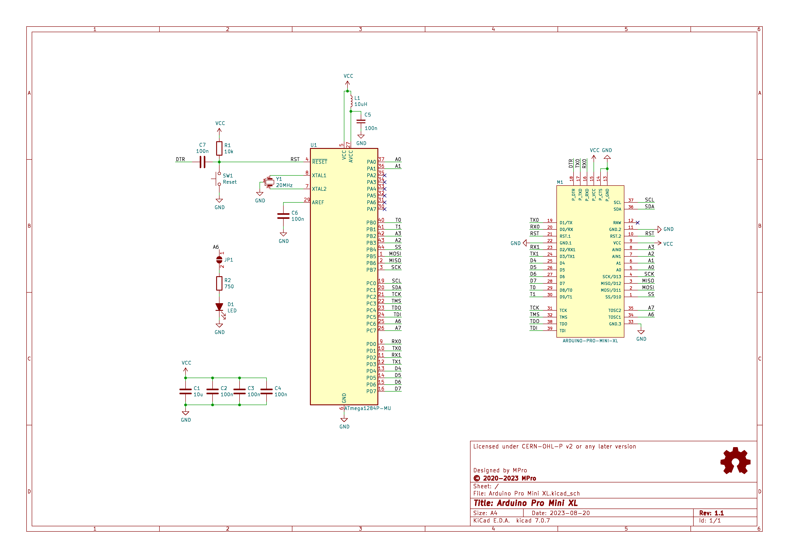
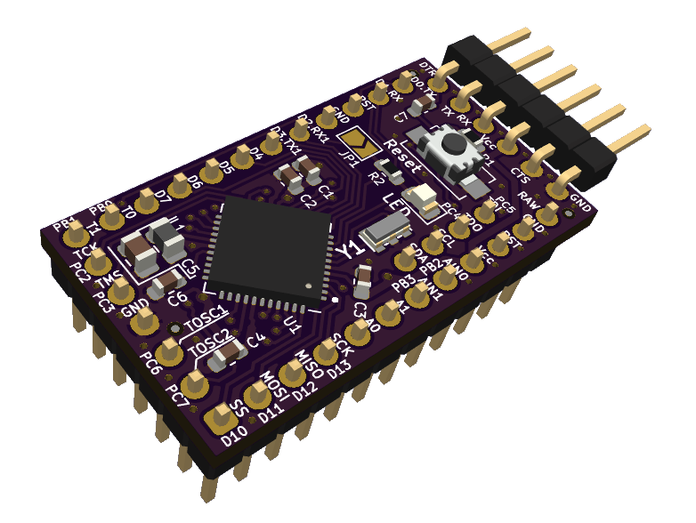

# **Arduino Pro Mini XL**

- [**Arduino Pro Mini XL**](#arduino-pro-mini-xl)
  - [**Overview**](#overview)
    - [**Features**](#features)
  - [**Schematic diagram**](#schematic-diagram)
  - [**Module visualisation**](#module-visualisation)
  - [**Assembly**](#assembly)
  - [**Production files**](#production-files)
  - [**Software Compatibility**](#software-compatibility)
    - [**Installing MightyCore**](#installing-mightycore)
  - [**Getting Started**](#getting-started)
    - [**Burning the Bootloader**](#burning-the-bootloader)
  - [**Troubleshooting**](#troubleshooting)
  - [**Physical Specifications**](#physical-specifications)
  - [**Reporting bugs**](#reporting-bugs)
  - [**Acknowledgments**](#acknowledgments)
  - [**License**](#license)
  - [**Support**](#support)

---

## **Overview**
The **Arduino Pro Mini XL** is a compact microcontroller board based on the **ATmega1284P**, designed to extend the capabilities of the standard Arduino Pro Mini while retaining its familiar form factor. With increased memory, additional I/O pins, and enhanced features, this board is well-suited for embedded applications requiring greater processing power and connectivity than the ATmega328P-based Arduino Pro Mini can provide. It integrates seamlessly with the Arduino ecosystem, making it accessible to hobbyists, engineers, and developers alike.

### **Features**
* **Microcontroller**: ATmega1284P
* **Flash Memory**: 128KB
* **SRAM**: 16KB
* **EEPROM**: 4KB
* **Digital I/O Pins**: 22
* **Analog Input Pins**: 2
* **Analog Comparator**: 1
* **PWM Channels**: 8
* **UARTs**: 2
* **SPI**: 1
* **I2C**: 1
* **Operating Voltage**: 5V
* **Clock Speed**: 20/16/8MHz
* **Form Factor**: Compatible with Arduino Pro Mini

---

## **Schematic diagram**
<p align="center"></p>


## **Module visualisation**
(click on the image to see the 3D model)
<p align="center"><a href="https://3dviewer.net/#model=https://github.com/michpro/Arduino_Pro_Mini_XL/blob/master/docs/Arduino_Pro_Mini_XL.wrl"></a></p>

## **Assembly**
[Interactive BOM and placement](https://michpro.github.io/Arduino_Pro_Mini_XL/ibom.html)

## **Production files**
Production files can be found [**here**](./production/).

---

## **Software Compatibility**

The Arduino Pro Mini XL is supported by the Arduino IDE through the [**MightyCore**](https://github.com/MCUdude/MightyCore) board package, which provides board definitions for the ATmega1284P.

### **Installing MightyCore**

To configure the Arduino IDE:

1. Open the Arduino IDE.
2. Navigate to `File` > `Preferences`.
3. Add the following URL to the `Additional Boards Manager URLs` field:  
   ```
   https://mcudude.github.io/MightyCore/package_MCUdude_MightyCore_index.json
   ```
4. Click `OK`.
5. Go to `Tools` > `Board` > `Boards Manager`.
6. Search for "MightyCore" and install the package.

After installation, select **"ATmega1284P"** under `Tools` > `Board`, and configure the variant and clock settings as needed.

## **Getting Started**

1. **Connect the Board**: Attach an FTDI-compatible cable or adapter to the 6-pin programming header.
2. **Configure the IDE**: Select the ATmega1284P board and the appropriate serial port in the Arduino IDE.
3. **Upload a Sketch**: Use a simple sketch, such as "Blink," to test functionality.
   ```cpp
   void setup()
   {
      pinMode(PIN_PC6, OUTPUT); // Onboard LED 
                                // Don't forget to close JP1.
   }

   void loop()
   {
      digitalWrite(PIN_PC6, HIGH);
      delay(1000);
      digitalWrite(PIN_PC6, LOW);
      delay(1000);
   }
   ```
4. **Verify Operation**: Confirm that the onboard LED blinks, indicating successful setup. **Don't forget to close JP1.**

### **Burning the Bootloader**

To burn the bootloader using an ISP programmer:

1. Connect the ISP programmer to the board’s pins.
2. In the Arduino IDE, select the ATmega1284P board and your programmer.
3. Choose `Tools` > `Burn Bootloader`.

Consult the MightyCore documentation for correct fuse settings.

## **Troubleshooting**

- **Upload Failures**: Verify board and port settings; check FTDI connections and drivers.
- **Power Issues**: Ensure input voltage is 5V (VCC); inspect for shorts. *Board has no RAW input*
- **Pin Mapping**: Confirm pin assignments, as they differ from the ATmega328P.

## **Physical Specifications**

- **Dimensions**: Comparable to the Arduino Pro Mini (18.5mm x 33mm).

---

## **Reporting bugs**

[Create an issue on GitHub](https://github.com/michpro/Arduino_Pro_Mini_XL/issues)

---

## **Acknowledgments**

Thanks to the Arduino community and the [**MightyCore**](https://github.com/MCUdude/MightyCore) developers for enabling support for the ATmega1284P.

---

## **License**
Copyright © 2020-2025 Michal Protasowicki

This project is released under CERN Open Hardware Licence Version 2 - Permissive.

[](./LICENSE)

---

## **Support**
If You find my projects interesting and You wanted to support my work, You can give me a cup of coffee or a keg of beer :)

[](https://www.paypal.me/michpro)&nbsp;&nbsp;&nbsp;&nbsp;&nbsp;[](https://ko-fi.com/F1F24CEW1)&nbsp;&nbsp;&nbsp;&nbsp;&nbsp;[](https://commerce.coinbase.com/checkout/ec299320-cbed-475d-976e-fdf37c1ac3d0)
